# Will-a-Customer-Accept-the-Coupon #
The major goal of this project is to predict if the drivers with/without passenger will accept more coupons than rejecting them, by using python
libraries for visualization, and also conditioning probabilities.

#### The programming language used is Python, and the libraries used were: Pandas, Seaborn, Matplotlib, and numpy ####

* The complete analysis, including observations,comments so all the work done is contained in the following Jupiter Notebook:

    [Jupiter Notebook used](https://github.com/Leopard-2019/Will-a-Customer-Accept-the-Coupon/blob/main/notebook/prompt_assig5_1.ipynb)

* There were some columns (age, income, expiration, Bar, CoffeeHouse, CarryAway, RestaurantLessThan20, and Restaurant20to50) defined as object that
  were manipultate, etc in order to be able to be treated as numerical in order to facilitate the analysis. 
  
* There were also some columns ()car, Bar,CoffeHouse, CarryAway,RestaurantlLessthan20, restaurant20To50) that present missing values.
 
*  The conditonal probability that drivers with 'Friend(s)' as passenger accept the coupons: "Coffe House", "Restaurant (<20)", and "Carry out & Take
   Away"  is the highest than the rest of the drivers without/with passenger, i.e, 'Alone', "Partner", and "Kid(s)". This is quite evident by looking
   at the results of the conditional probabilities visualized using the barplot shown below.
   
   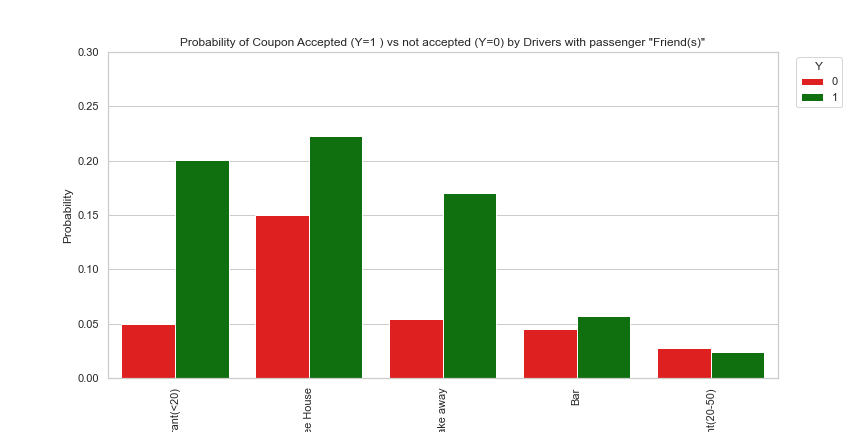
   
   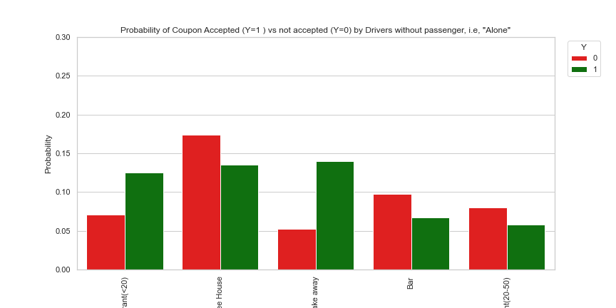
   
   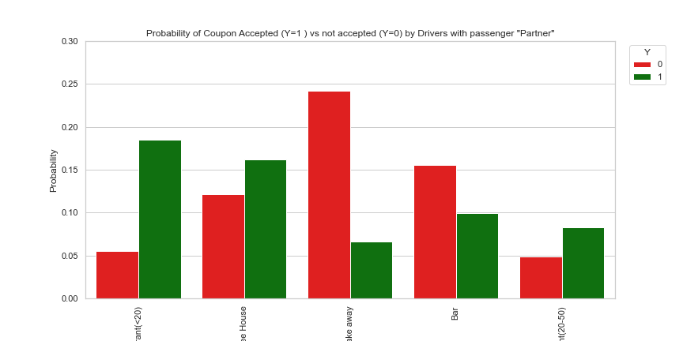
   
   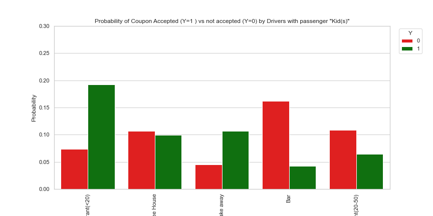

* The coupons most likely to be accepted for all the drivers without/with passenger, but with Kid(s) are:"Coffe House", "Restaurant (<20)", 
  and "Carry out & Take Away".
  
 * The conditional probability that drivers without/with passengers accepts coupons  is much higher by a wide margin during sunny days as shown in the
   barplot below:
 
    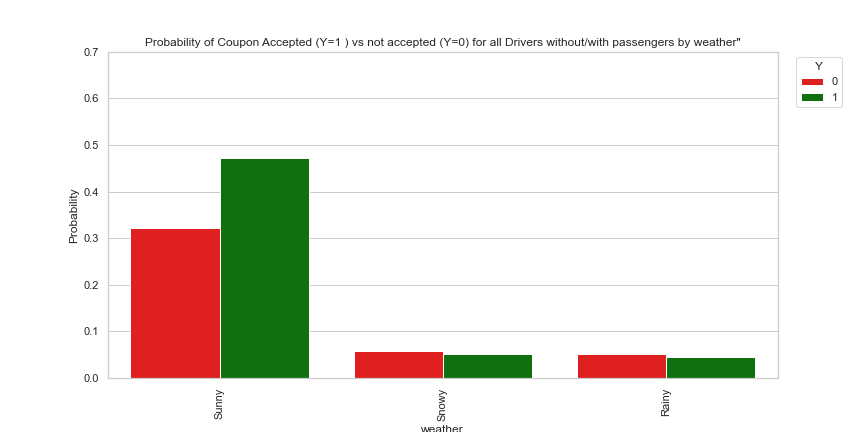
    
 * The conditional probability that "Male" drivers  accepts coupons  is slighlty higher than the Female drivers as shown in barplot below:

    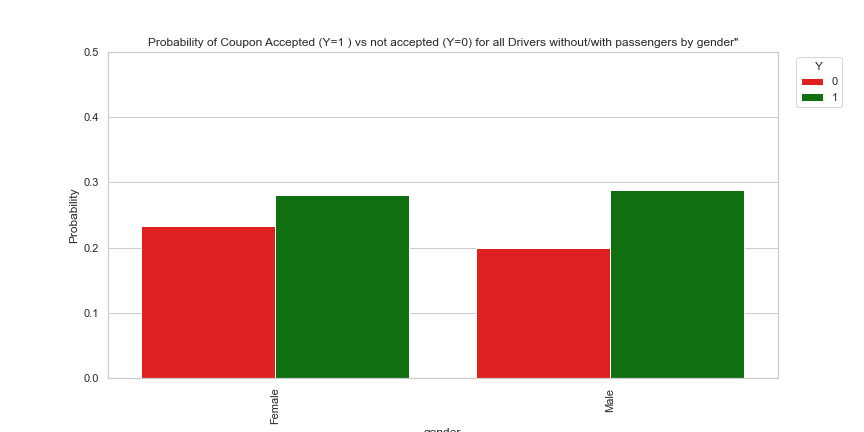
    
 * The boxplot inmediately below indicates that the drivers without passsenger, i.e, "Alone", and with "Friends" who accepted the coupons (Y=1) 
   have about the same means age  **(please see the small white circles )** through the different coupons categories, i.e. drivers without 
   and with the aforementioned passengers in their early 30's are more willing to accept the coupons (Y=1). Conversely, the drivers with / without
   passengers who did not accept the coupon (Y=0) are a bit older as shown in the boxplot that follow the first one mentioned.

    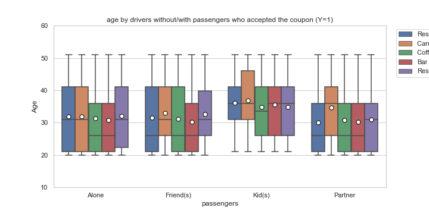
    
    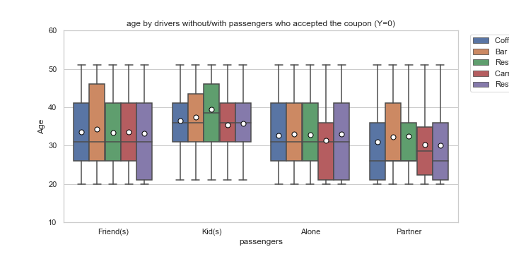
    
  *The boxplot below indicates that the drivers without passsenger, i.e, "Alone", and with "Friends" who accepted the coupon (Y=1) have about the
  same media income, but quite lower than the rest of drivers with  passenger groups  "Kid(s)", and "Partner" (see also the heatmap shown).Quite
  similar observation is applied by comparing **the mean income among those  groups who accepted the coupon as indicated by the white small circle
  markers posted on same aforementioned boxplot**.These observations make sense based on figure 1B, where the groups that did accept more coupon 
  are the drivers without passenger, i.e, "Alone", and the ones with "Friend(s)". Basically,  it is expected that groups with lower income media 
  will be more keen to accept coupons. it is also important to highlight that the drivers without/with   passengers who did not accept the coupon
  (Y=0) have higher mean income as show in the next boxplot.
  
  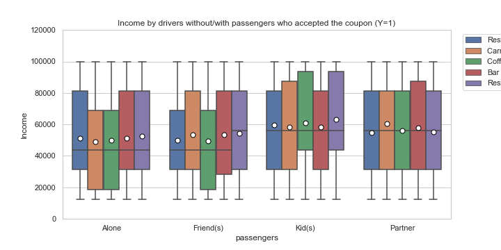
  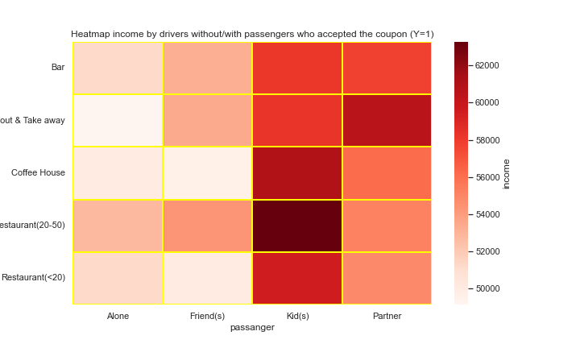
  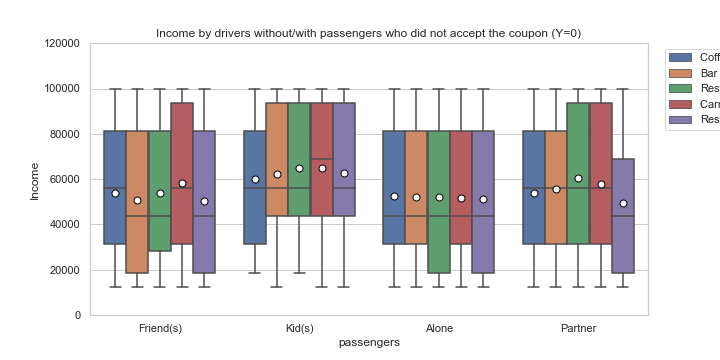
  
  * The catplot below indicates that the all drivers with/without passengers were much more keen to accept the coupons that expires in 24 hours
    (i.e, 1 day).

   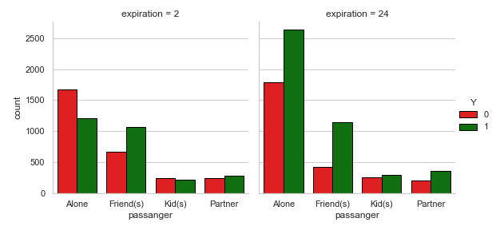
   
   * A exercise Constructing a null and alternative hypothesis for the difference between drivers without/with passengers  who go to the Coffee 
     House more than once a month and income less than $50000 to all other drivers without/with passenger indicated that:
             **The p_value=0.0218 is less than ${\alpha}=0.05$ so we did reject ${H}_{0}$, i.e. the null hypothesis**
   * As a result, it is possible to conclude that the drivers without/with passenger with income less than $50000 go more often to the Coffee House
     than drivers without/with passenger with higher income, independently if the first group have accepted or not the coupons.
      
   * There were other columns that were also used in this analysis, but I just wanted to highlight the major finding.
    
  
